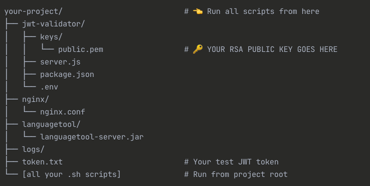

# Scribe-Spellchecker
### The Scribe Spelling and Grammar checker is a microservice used by the Scribe application to check spelling and grammar in the created letters. As the user types the front-end sends the payload to the spell checker for validation.  The langagetool service is a stand-alone server that parses the payload, identifies the errors, and provides suggestion for both spelling and grammar.



## Installation (Development)
1. **Ensure that Java is installed**
```bash
    java --version
```
2. **Setup the JWT-validator**
  - Go to terminal and change directory to jwt-validator
  - Install the validator
  ```bash
  npm install
  ```

3. **Make scripts executable:**
   ```bash
   chmod +x scripts/*.sh

4. **Install nginx**
  - From the root of the project run the following command in the terminal:
  ```bash
      ./scripts/install-nginx.sh
  ```

5. **Start the JWT validator**
  ```bash
     ./scripts/start-all.sh
  ```

6. **Start the nginx server**
  ```bash
      ./scripts/start-nginx.sh
  ```

## Testing

# Authentication Testing Guide

## What's Happening

Your curl command:
```bash
curl -X POST \
  -H "Content-Type: application/x-www-form-urlencoded" \
  -d "text=Test with mispelled word&language=en-US" \
  http://localhost:8081/v2/check
```

Is going **directly** to LanguageTool, bypassing authentication entirely.

## Service Architecture

```
┌─────────────────┐    ┌─────────────────┐    ┌─────────────────┐
│   Your Client   │    │   JWT Validator │    │  LanguageTool   │
│                 │    │   Port 3001     │    │   Port 8081     │
└─────────────────┘    └─────────────────┘    └─────────────────┘
         │                       │                       │
         │              ┌─────────────────┐              │
         └──────────────▶│ nginx Proxy     │──────────────┘
                        │ Port 8010       │
                        │ (with auth)     │
                        └─────────────────┘
```

## Port Explanation

- **8081** = Direct LanguageTool (no authentication)
- **8010** = nginx proxy (with JWT authentication) 
- **3001** = JWT validator service


### Generate Test Token
```bash
curl -X POST http://localhost:3001/generate-test-token \
  -H "Content-Type: application/json" \
  -d '{"userId":"test-user","permissions":["spellcheck"]}'
```

### Test Authentication
```bash
# Without authentication (should fail with nginx)
curl -X POST \
  -H "Content-Type: application/x-www-form-urlencoded" \
  -d "text=Test with mispelled word&language=en-US" \
  http://localhost:8010/v2/check
```
Expected Output: {"error":"Authentication required","code":"AUTHENTICATION_REQUIRED"}%          

```bash
# With valid token (should succeed)
curl -X POST \
  -H "Authorization: Bearer YOUR_TOKEN_HERE" \
  -H "Content-Type: application/x-www-form-urlencoded" \
  -d "text=Test with mispelled word&language=en-US" \
  http://localhost:8010/v2/check
```

### Note: Port 8010 uses the nginx and jwt-authentication.  Port 8081 by-passes authentication and goes straight to the langaugetool service


## Step-by-Step Setup

### 1. JWT Validator Setup
```bash
cd jwt-validator
npm install
# Edit .env file - set your JWT_SECRET to match your app
NODE_ENV=development npm start
```

### 2. LanguageTool Setup
```bash
# In a separate terminal
java -Xms512m -Xmx2g -cp languagetool-server.jar \
  org.languagetool.server.HTTPServer \
  --port 8081 \
  --public \
  --allow-origin "*"
```

### 3. nginx Setup (Optional)
```bash
# Test configuration
nginx -t -c /path/to/your/nginx.conf

# Start nginx
nginx -c /Users/matthew.s.ratliff/Development/scribe-spellchecker/nginx/nginx.conf
```

## Service URLs

- **JWT Validator**: http://localhost:3001
- **LanguageTool (direct)**: http://localhost:8081/v2/check
- **Authenticated API**: http://localhost:8010/v2/check (with nginx)

## Management Commands

```bash
# Start all services
./scripts/start-all.sh

# Stop all services  
./scripts/stop-all.sh

# Test authentication
./scripts/test-auth.sh

# View logs
tail -f logs/*.log

# Check service status
curl http://localhost:3001/health
curl http://localhost:8081/v2/check
curl http://localhost:8010/health
```

## Environment Variables

### jwt-validator/.env
```bash
PUBLIC_KEY_PATH=keys/public.pem
NODE_ENV=development
PORT=3001
KEY_SOURCE=file
```

## Troubleshooting

### Port conflicts
```bash
# Check what's using a port
lsof -i :3001
lsof -i :8081  
lsof -i :8010

# Kill process using port
kill $(lsof -t -i:3001)
```

### Logs
```bash
# JWT Validator logs
tail -f logs/jwt-validator.log

# LanguageTool logs  
tail -f logs/languagetool.log

# nginx logs (system location)
tail -f /var/log/nginx/languagetool_access.log
tail -f /var/log/nginx/languagetool_error.log
```

### Common Issues
1. **JWT secret mismatch**: Make sure JWT_SECRET in .env matches your main app
2. **LanguageTool JAR not found**: Ensure the JAR path is correct
3. **Port already in use**: Stop conflicting services or change ports
4. **nginx permission denied**: Run nginx commands with sudo